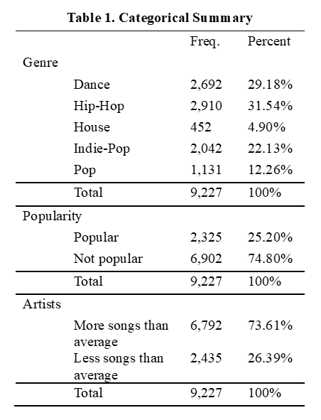
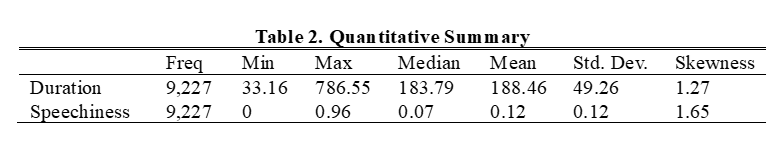
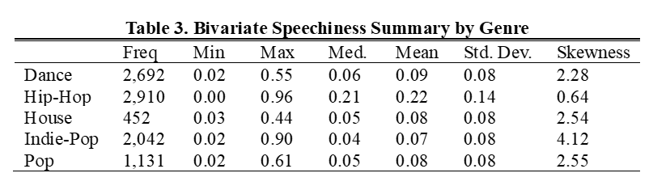
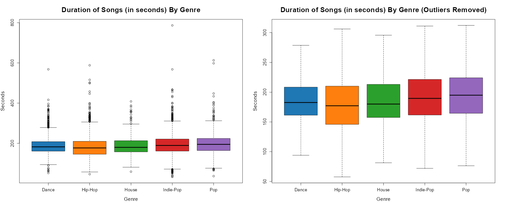
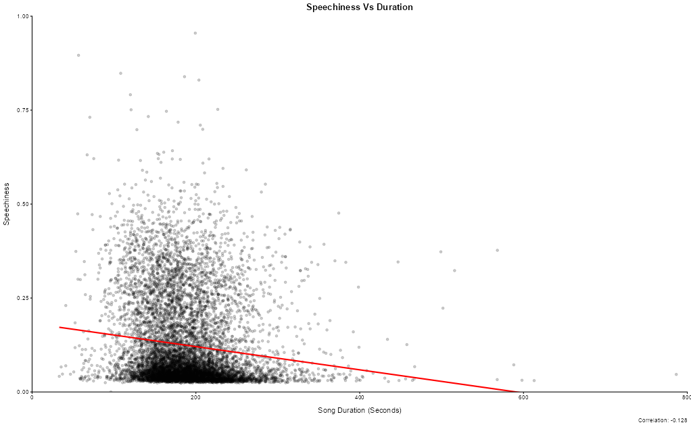
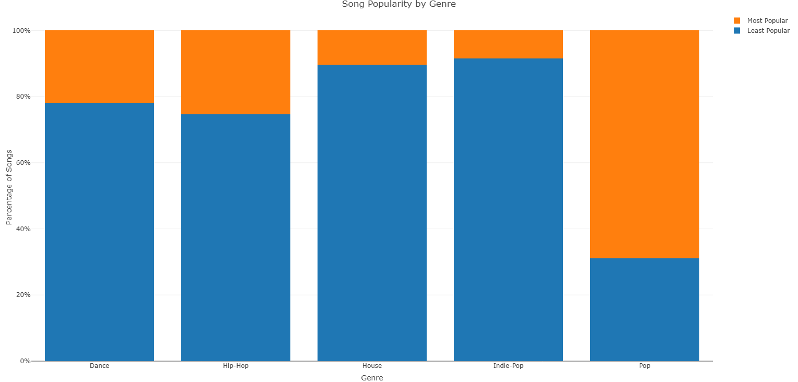
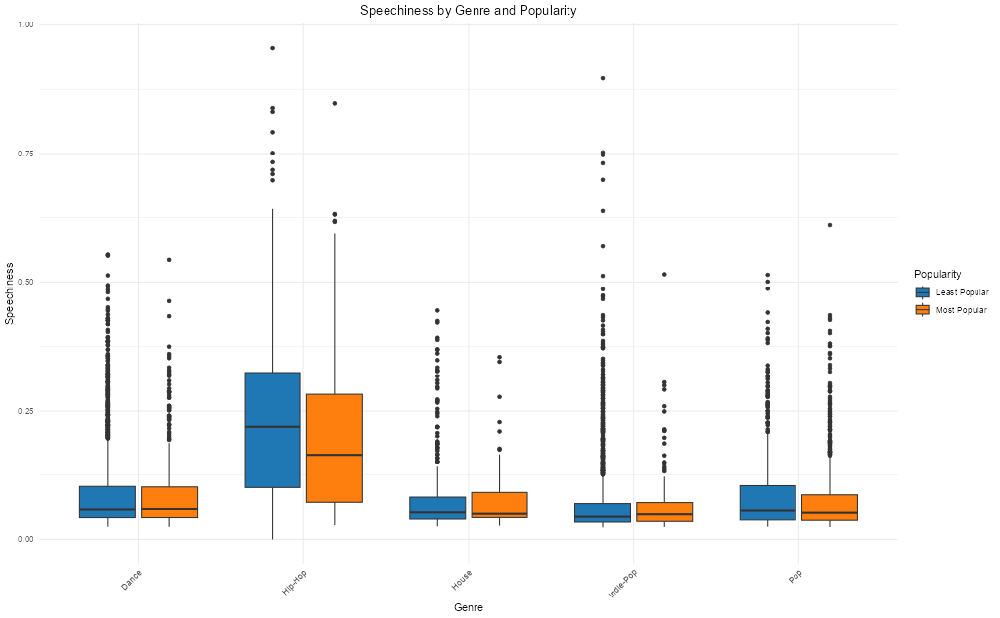

# Spotify Music Market Analysis

An exploratory data analysis project investigating how song and artist characteristics relate to Spotify track popularity. The analysis translates descriptive and bivariate findings into strategic recommendations for music producers.

## Business question

Which song and artist characteristics are associated with higher track popularity, and what opportunities might those patterns suggest for music producers?

## Dataset

This project uses the [Spotify 1 Million Tracks dataset](https://www.kaggle.com/datasets/amitanshjoshi/spotify-1million-tracks).

The analysis filters the dataset to tracks released between 2020 and 2023 and focuses on five genres: Dance, Hip-Hop, House, Indie-Pop, and Pop. The final analytical dataset contains 9,227 tracks.

The original `spotify_data.csv` file is not included because it exceeds GitHub’s 100 MB file-size limit. Download the source data from Kaggle and save it in the `data/` folder if you want to reproduce the data-cleaning process.

## Tools

- R
- dplyr
- summarytools
- flextable
- psych
- ggplot2
- plotly

## Key findings

- Pop had the highest proportion of tracks classified as popular, despite being less represented in the filtered sample than dance and hip-hop.
- Artists with above-average numbers of releases were more likely to have popular tracks.
- Popular tracks were generally concentrated around approximately 2:55 to 3:20 in duration.
- Duration and speechiness had a weak negative correlation (\(r = -0.128\)).
- Speechiness varied substantially by genre, with hip-hop showing the highest typical speechiness values.

## Visualizations

### Categorical summary



### Quantitative summary



### Speechiness by genre



### Duration by genre



### Speechiness by duration



### Popularity by genre



### Speechiness by genre and popularity



## Repository structure

```text
spotify-music-market-analysis/
├── code/
│   └── 01_data_wrangling.R
│   └── 02_exploratory_data_analysis.R
├── data/
│   ├── clean_spotify_data.csv
│   └── spotify_data.csv             # Not tracked; download separately
├── outputs/
│   ├── figures/
│   └── tables/
├── report/
│   ├── spotify_music_market_analysis_report.docx
│   └── spotify_music_market_analysis_report.pdf
└── README.md
```

## Reproduce the analysis

1. Clone or download this repository.
2. Download the original dataset from Kaggle and save it as `data/spotify_data.csv` if needed.
3. Open `code/spotify_analysis.R` in RStudio.
4. Install any missing R packages.
5. Run the script from the repository’s main folder.

## Full report

The final report is available in the [`report/`](report/) folder.

## Author

Francisco Rezzonico
